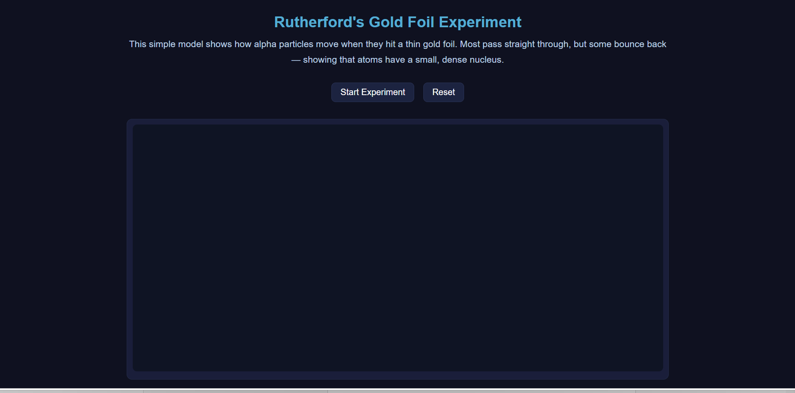

# Rutherford Gold Foil Experiment Simulation

##  Project Overview

This project is an interactive web-based simulation of Rutherford’s Gold Foil Experiment. The simulation demonstrates how alpha particles behave when directed at a thin sheet of gold foil, helping users understand Rutherford’s discovery of the atomic nucleus.

The project visually explains:
- Most alpha particles pass straight through the atom
- Some particles bend slightly
- A few particles bounce back because of the dense nucleus

This educational simulation was built using front-end web development technologies and focuses on interactive learning and responsive design.

---

##  Live Demo

🔗 https://daljitkaur08.github.io/rutherford-simulation/

---

##  Tech Stack

- HTML5
- CSS3
- JavaScript
- GitHub Pages

---

##  Features

- Interactive particle movement simulation
- Start and Reset controls
- Educational explanation section
- Responsive layout
- Modern dark-themed user interface
- Animated alpha particle scattering effect

---

##  How to Install / Run

### Option 1 — Run Online

Open the live project in your browser:

https://daljitkaur08.github.io/rutherford-simulation/

---

### Option 2 — Run Locally

#### Step 1 — Clone Repository

```bash
git clone https://github.com/DaljitKaur08/rutherford-simulation.git
```

#### Step 2 — Open Project Folder

Open the downloaded project folder on your computer.

#### Step 3 — Run Project

Open `index.html` in any web browser.

No additional installation or dependencies are required.

---

## 📸 Screenshot



---

##  Learning Outcomes

Through this project, I improved my skills in:
- DOM Manipulation
- JavaScript animations
- Front-end web development
- Responsive web design
- GitHub project organization
- Creating interactive educational applications

---

##  Author

Daljit Kaur

- GitHub: https://github.com/DaljitKaur08
- LinkedIn: https://www.linkedin.com/in/daljit-kaur-mitt/

---

##  License

This project is licensed under the MIT License.


